# Markdown-Mermaid

## 介绍
`Mermaid` 允许你使用文本和代码创建图表和可视化。

它是一个基于 `JavaScript` 的图表绘制工具，可渲染 `Markdown` 启发的文本定义以动态创建和修改图表。

## 流程图
流程图由节点（几何形状）和边（箭头或线条）组成。`Mermaid` 代码定义了如何制作节点和边，并适应不同的箭头类型、多方向箭头以及任何与子图的链接。
<pre>
```mermain
graph TD
  A[Christmas] -->|Get money| B(Go shopping)
  B --> C{Let me think}
  C -->|One| D[Laptop]
  C -->|Two| E[iPhone]
  C -->|Three| F[fa:fa-car Car]
```
</pre>

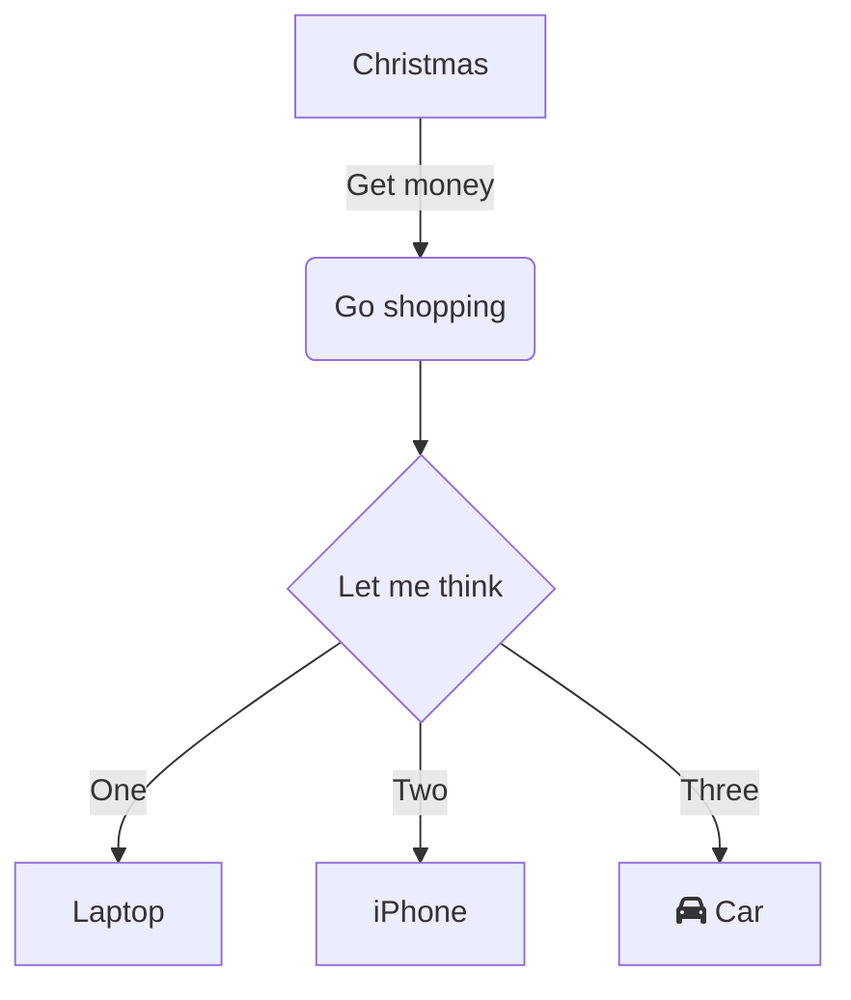

## 时序图
序列图是一种交互图，显示进程如何彼此运行以及以什么顺序运行
<pre>
```mermain
sequenceDiagram
  participant Alice
  participant Bob
  Alice->>John: Hello John, how are you?
  loop Healthcheck
    John->>John: Fight against hypochondria
  end
  Note right of John: Rational thoughts <br/>prevail...
  John-->>Alice: Great!
  John->>Bob: How about you?
  Bob-->>John: Jolly good!
```
</pre>

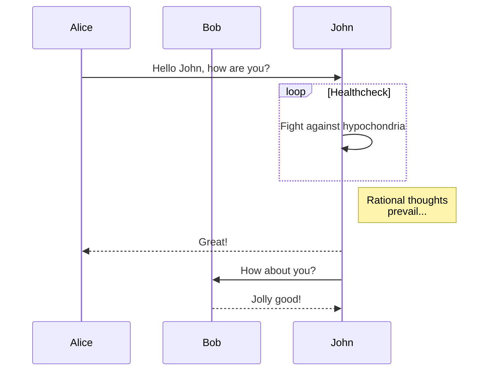

## 类图
类图是面向对象建模的主要构建块。它用于应用结构的一般概念建模，以及将模型转换为编程代码的详细建模。类图也可用于数据建模。类图中的类表示主要元素、应用中的交互以及要编程的类
<pre>
```mermain
---
title: Animal example
---
classDiagram
  note "From Duck till Zebra"
  Animal <|-- Duck
  note for Duck "can fly\ncan swim\ncan dive\ncan help in debugging"
  Animal <|-- Fish
  Animal <|-- Zebra
  Animal : +int age
  Animal : +String gender
  Animal: +isMammal()
  Animal: +mate()
  class Duck{
    +String beakColor
    +swim()
    +quack()
  }
  class Fish{
    -int sizeInFeet
    -canEat()
  }
  class Zebra{
    +bool is_wild
    +run()
  }
```
</pre>

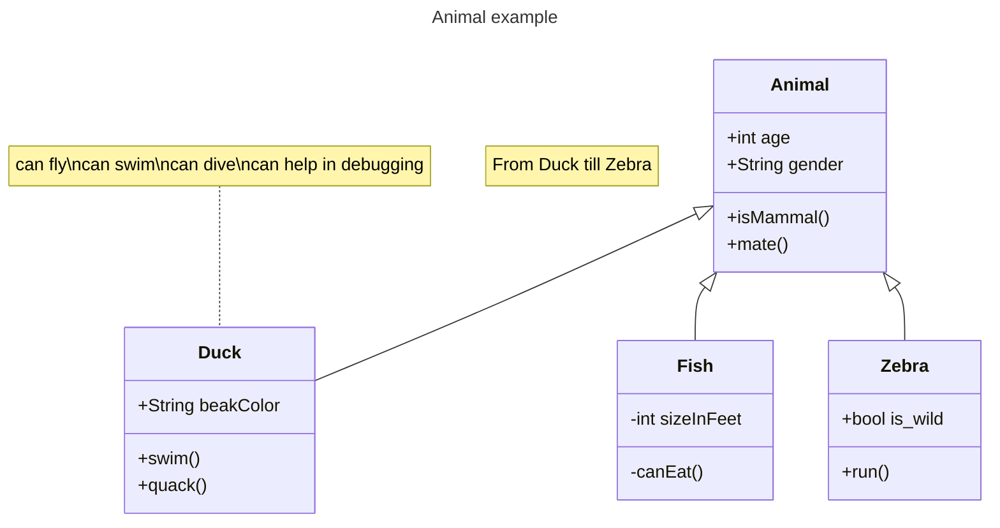

## 状态图
状态图是计算机科学及相关字段中用于描述系统行为的一种图表
<pre>
```mermain
---
title: Simple sample
---
stateDiagram-v2
  [*] --> Still
  Still --> [*]

  Still --> Moving
  Moving --> Still
  Moving --> Crash
  Crash --> [*]
```
</pre>

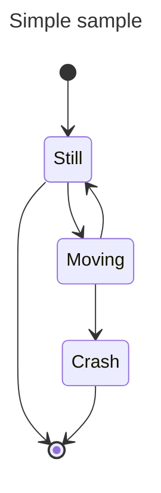

## 实体关系图
实体关系模型（或 `ER` 模型）描述特定知识字段中相关的感兴趣的事物
<pre>
```mermain
---
title: Order example
---
erDiagram
  CUSTOMER ||--o{ ORDER : places
  ORDER ||--|{ LINE-ITEM : contains
  CUSTOMER }|..|{ DELIVERY-ADDRESS : uses
```
</pre>

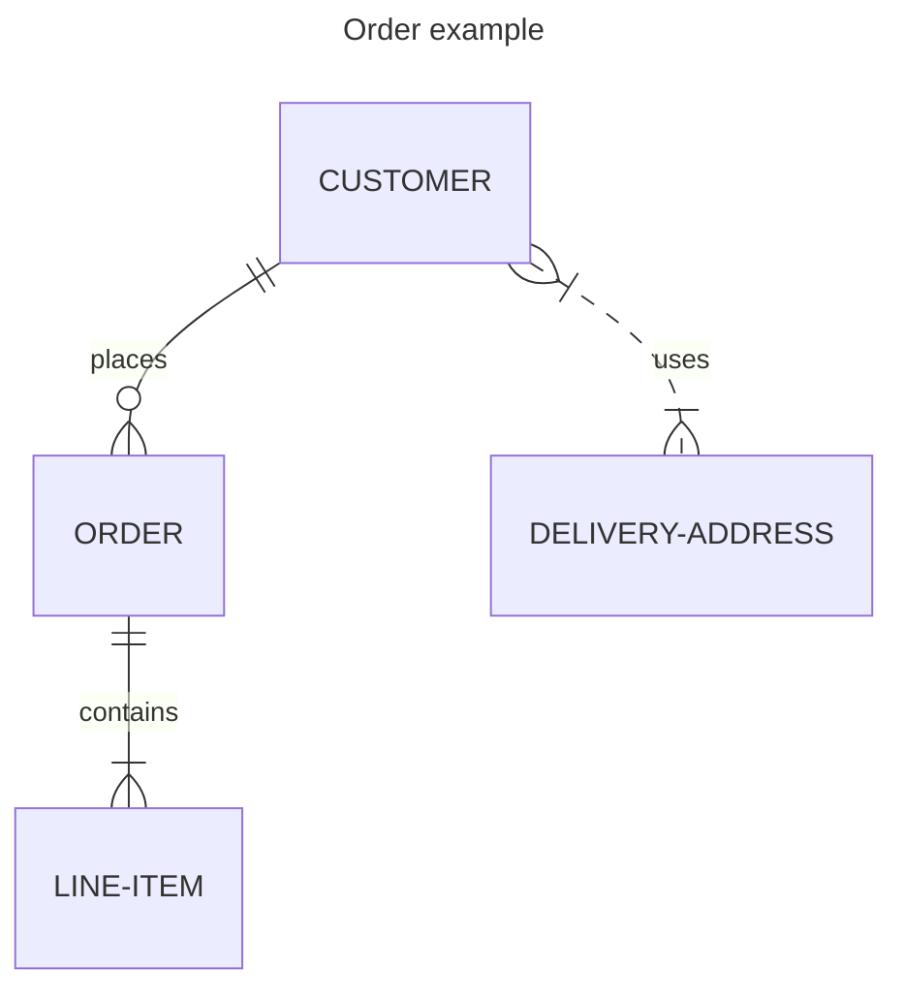


## 用户旅程图
用户旅程高度详细地描述了不同用户在系统、应用或网站内完成特定任务所采取的步骤
<pre>
```mermain
journey
  title My working day
  section Go to work
    Make tea: 5: Me
    Go upstairs: 3: Me
    Do work: 1: Me, Cat
  section Go home
    Go downstairs: 5: Me
    Sit down: 5: Me
```
</pre>

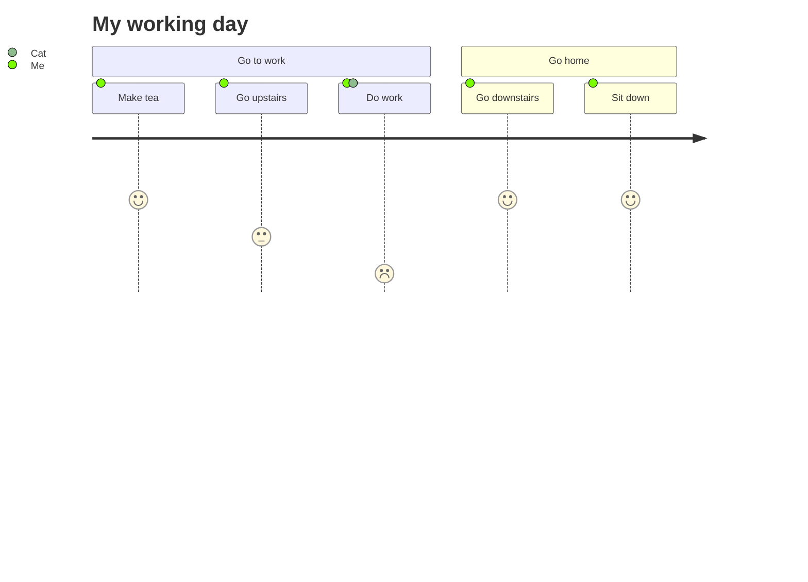

## 甘特图
甘特图是一种柱状图,它说明了项目进度表以及任何一个项目完成所需的时间
<pre>
```mermain
gantt
  title A Gantt Diagram
  dateFormat YYYY-MM-DD
  section Section
    A task          :a1, 2014-01-01, 30d
    Another task    :after a1, 20d
  section Another
    Task in Another :2014-01-12, 12d
    another task    :24d
```
</pre>

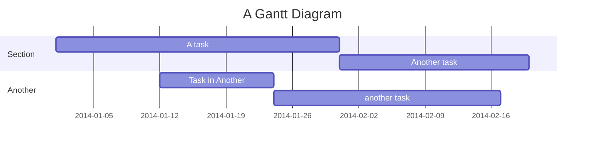

## 饼图
饼图（或圆形图）是一种圆形统计图形，将其划分为多个切片以说明数字比例
<pre>
```mermain
pie title Pets adopted by volunteers
  "Dogs" : 386
  "Cats" : 85
  "Rats" : 15
```
</pre>

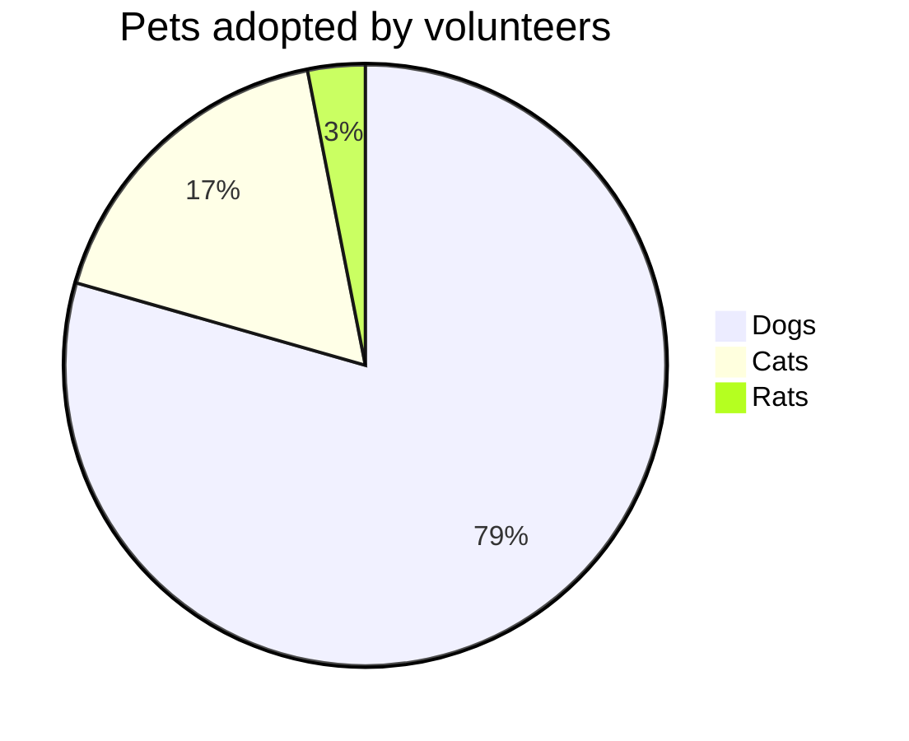

## 象限图
象限图是分为四个象限的数据的直观表示。它用于在二维网格上绘制数据点，其中一个变量表示在 `x` 轴上，另一个变量表示在 `y` 轴上。象限是通过根据一组特定于所分析数据的标准将图表分为四个相等部分来确定的。象限图通常用于识别数据的模式和趋势，并根据图表中数据点的位置确定操作的优先级
<pre>
```mermain
quadrantChart
  title Reach and engagement of campaigns
  x-axis Low Reach --> High Reach
  y-axis Low Engagement --> High Engagement
  quadrant-1 We should expand
  quadrant-2 Need to promote
  quadrant-3 Re-evaluate
  quadrant-4 May be improved
  Campaign A: [0.3, 0.6]
  Campaign B: [0.45, 0.23]
  Campaign C: [0.57, 0.69]
  Campaign D: [0.78, 0.34]
  Campaign E: [0.40, 0.34]
  Campaign F: [0.35, 0.78]
```
</pre>

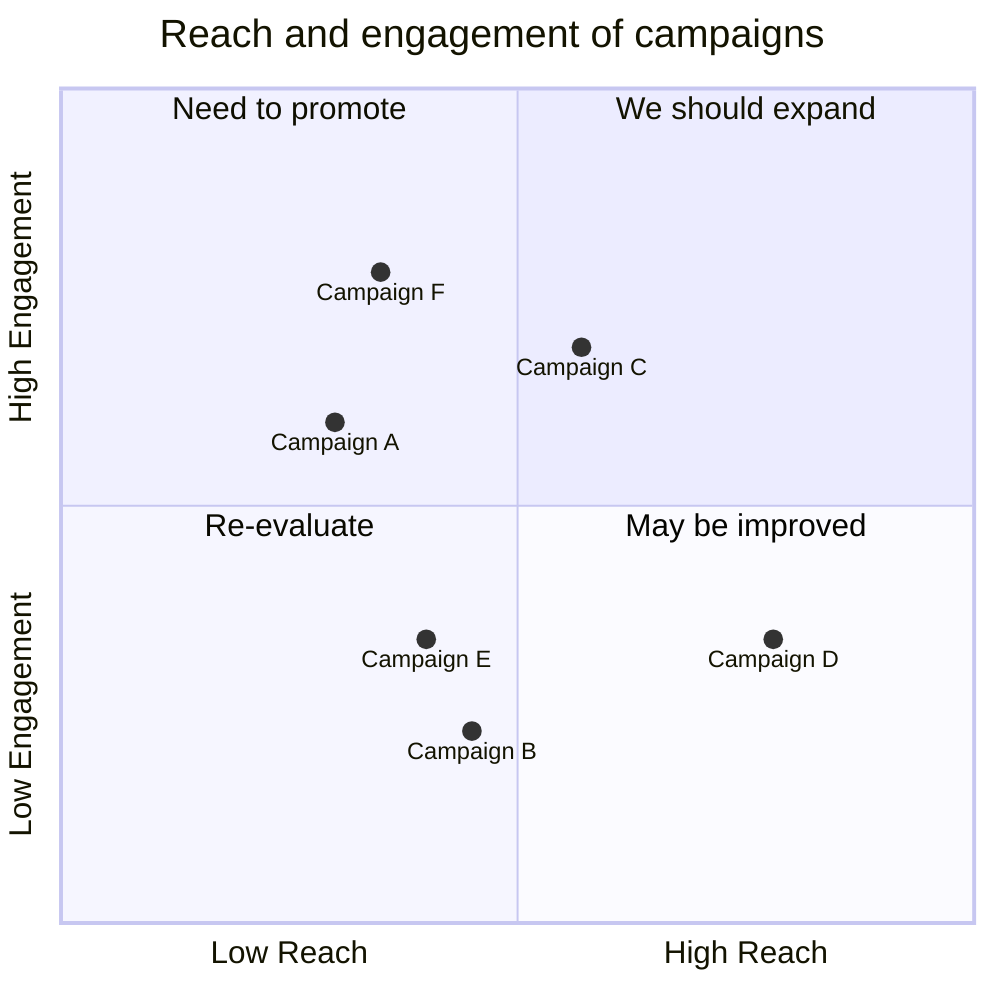

## 需求图
需求图提供了需求及其相互之间以及其他记录元素之间的联系的可视化
<pre>
```mermain
requirementDiagram

requirement test_req {
  id: 1
  text: the test text.
  risk: high
  verifymethod: test
}

element test_entity {
  type: simulation
}

test_entity - satisfies -> test_req
```
</pre>

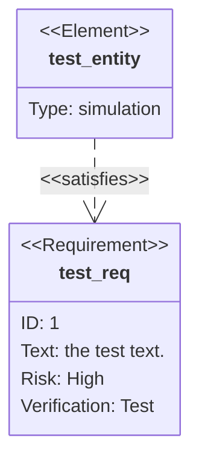

## Gitgraph 图
`Git` 图表是各个分支上 `git` 提交和 `git` 操作（命令）的图形表示
<pre>
```mermain
---
title: Example Git diagram
---
gitGraph
  commit
  commit
  branch develop
  checkout develop
  commit
  commit
  checkout main
  merge develop
  commit
  commit
```
</pre>

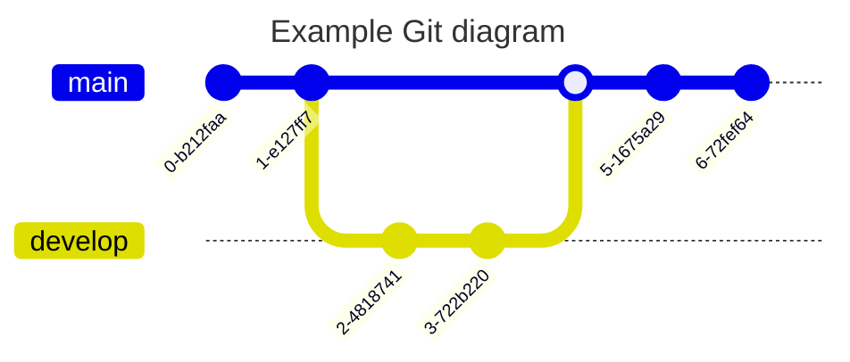

## 思维导图
思维导图是一种图表，用于将信息直观地组织成层次结构，显示整体各个部分之间的关系。它通常是围绕一个概念创建的，在空白页面的中心绘制为图片，并在其中添加相关的想法表示，例如图片、单词和单词的一部分。主要思想与中心概念直接相关，而其他思想则从这些主要思想中分支出来
<pre>
```mermain
mindmap
  root((mindmap))
    Origins
      Long history
      ::icon(fa fa-book)
      Popularisation
        British popular psychology author Tony Buzan
    Research
      On effectiveness<br/>and features
      On Automatic creation
        Uses
          Creative techniques
          Strategic planning
          Argument mapping
    Tools
      Pen and paper
      Mermaid
```
</pre>

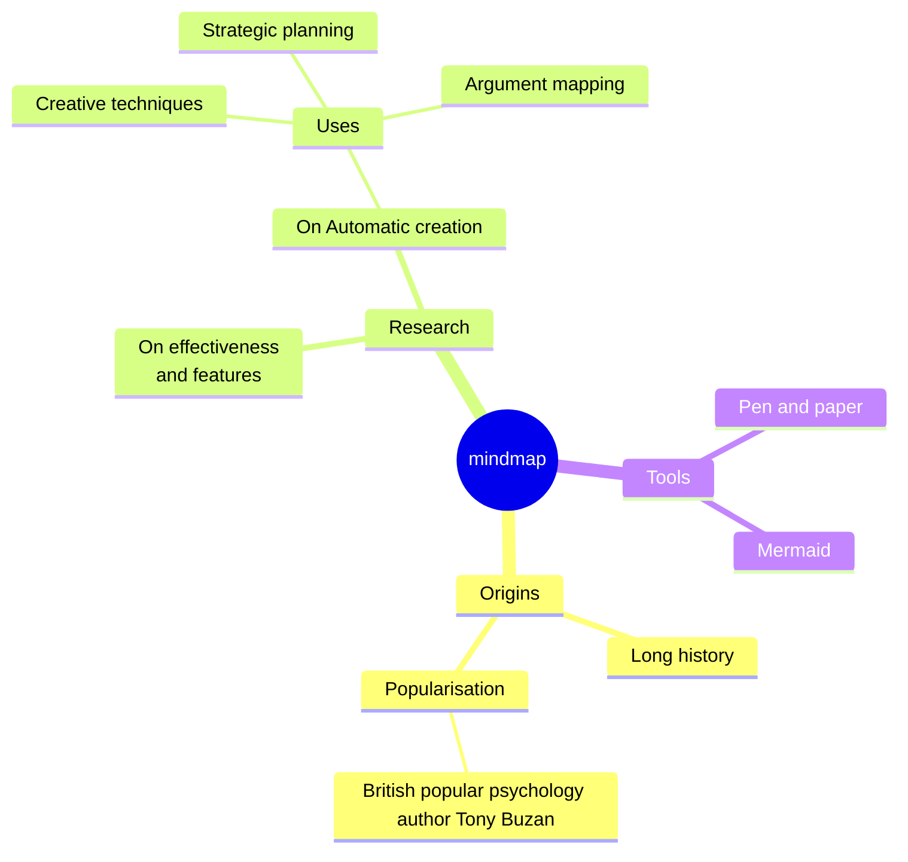

## 时间线图
时间线是一种图表，用于说明事件、日期或时间段的年表。它通常以图形方式渲染以指示时间的流逝，并且通常按时间顺序组织
<pre>
```mermain
timeline
  title History of Social Media Platform
  2002 : LinkedIn
  2004 : Facebook
        : Google
  2005 : Youtube
  2006 : Twitter
```
</pre>

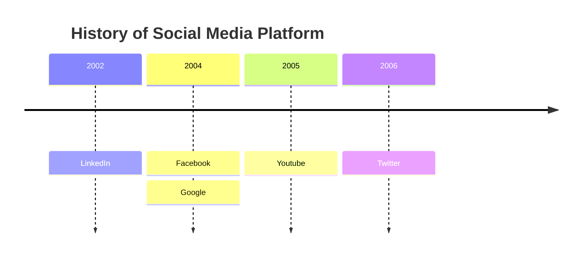

## 桑基图
桑基图是一种可视化，用于描述从一组值到另一组值的流动
<pre>
```mermain
---
config:
  sankey:
    showValues: false
---
sankey-beta

Agricultural 'waste',Bio-conversion,124.729
Bio-conversion,Liquid,0.597
Bio-conversion,Losses,26.862
Bio-conversion,Solid,280.322
Bio-conversion,Gas,81.144
Biofuel imports,Liquid,35
Biomass imports,Solid,35
Coal imports,Coal,11.606
Coal reserves,Coal,63.965
Coal,Solid,75.571
District heating,Industry,10.639
District heating,Heating and cooling - commercial,22.505
District heating,Heating and cooling - homes,46.184
Electricity grid,Over generation / exports,104.453
Electricity grid,Heating and cooling - homes,113.726
Electricity grid,H2 conversion,27.14
Electricity grid,Industry,342.165
Electricity grid,Road transport,37.797
Electricity grid,Agriculture,4.412
Electricity grid,Heating and cooling - commercial,40.858
Electricity grid,Losses,56.691
Electricity grid,Rail transport,7.863
Electricity grid,Lighting & appliances - commercial,90.008
Electricity grid,Lighting & appliances - homes,93.494
Gas imports,Ngas,40.719
Gas reserves,Ngas,82.233
Gas,Heating and cooling - commercial,0.129
Gas,Losses,1.401
Gas,Thermal generation,151.891
Gas,Agriculture,2.096
Gas,Industry,48.58
Geothermal,Electricity grid,7.013
H2 conversion,H2,20.897
H2 conversion,Losses,6.242
H2,Road transport,20.897
Hydro,Electricity grid,6.995
Liquid,Industry,121.066
Liquid,International shipping,128.69
Liquid,Road transport,135.835
Liquid,Domestic aviation,14.458
Liquid,International aviation,206.267
Liquid,Agriculture,3.64
Liquid,National navigation,33.218
Liquid,Rail transport,4.413
Marine algae,Bio-conversion,4.375
Ngas,Gas,122.952
Nuclear,Thermal generation,839.978
Oil imports,Oil,504.287
Oil reserves,Oil,107.703
Oil,Liquid,611.99
Other waste,Solid,56.587
Other waste,Bio-conversion,77.81
Pumped heat,Heating and cooling - homes,193.026
Pumped heat,Heating and cooling - commercial,70.672
Solar PV,Electricity grid,59.901
Solar Thermal,Heating and cooling - homes,19.263
Solar,Solar Thermal,19.263
Solar,Solar PV,59.901
Solid,Agriculture,0.882
Solid,Thermal generation,400.12
Solid,Industry,46.477
Thermal generation,Electricity grid,525.531
Thermal generation,Losses,787.129
Thermal generation,District heating,79.329
Tidal,Electricity grid,9.452
UK land based bioenergy,Bio-conversion,182.01
Wave,Electricity grid,19.013
Wind,Electricity grid,289.366
```
</pre>

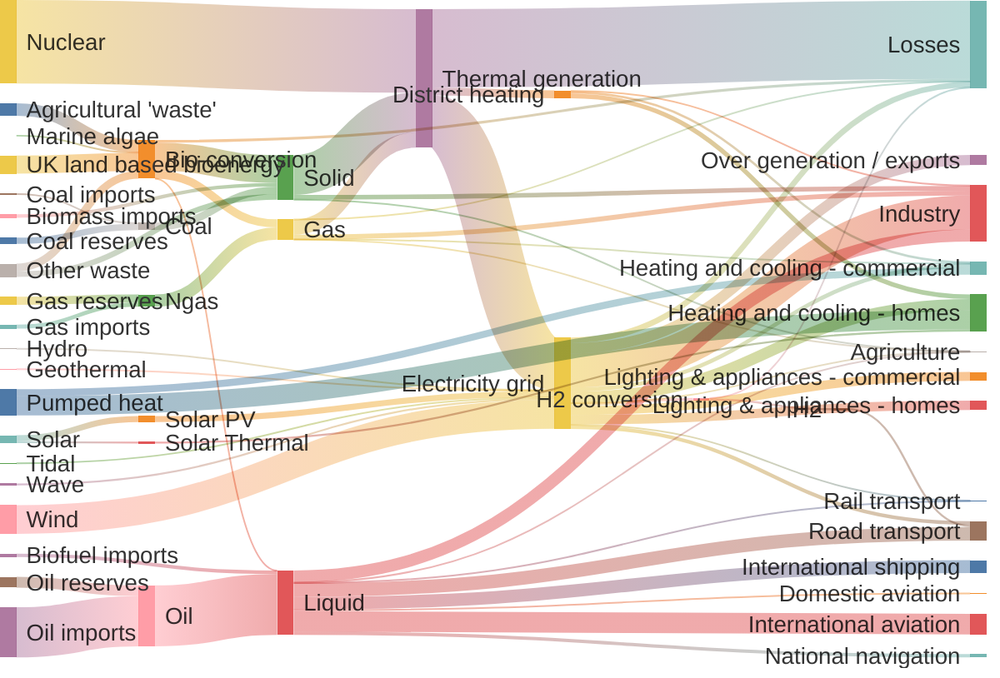

## XY Chart
`XY` 图表是一个综合图表模块，包含利用 `x` 轴和 `y` 轴进行数据表示的各种类型的图表。目前，它包括两种基本图表类型：柱状图和折线图
<pre>
```mermain
xychart-beta
  title "Sales Revenue"
  x-axis [jan, feb, mar, apr, may, jun, jul, aug, sep, oct, nov, dec]
  y-axis "Revenue (in $)" 4000 --> 11000
  bar [5000, 6000, 7500, 8200, 9500, 10500, 11000, 10200, 9200, 8500, 7000, 6000]
  line [5000, 6000, 7500, 8200, 9500, 10500, 11000, 10200, 9200, 8500, 7000, 6000]
```
</pre>

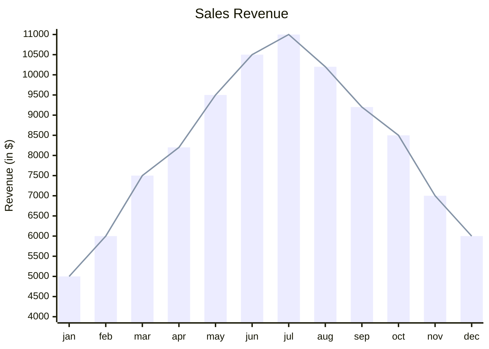

## Block Diagram
框图是一种直观、有效的方式来直观地表示复杂的系统、流程或架构
<pre>
```mermain
block-beta
columns 1
  db(("DB"))
  blockArrowId6<["&nbsp;&nbsp;&nbsp;"]>(down)
  block:ID
    A
    B["A wide one in the middle"]
    C
  end
  space
  D
  ID --> D
  C --> D
  style B fill:#969,stroke:#333,stroke-width:4px
```
</pre>

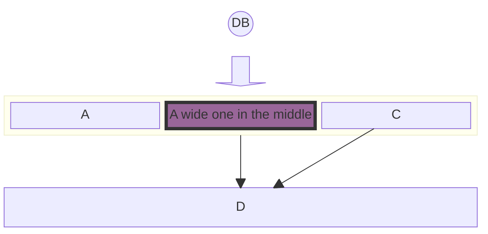

## 参考
1. [mermaid-图表](https://theme.sugarat.top/config/component.html#mermaid-%E5%9B%BE%E8%A1%A8)
1. [mermaid Wiki](https://mermaid.nodejs.cn/intro/getting-started.html)