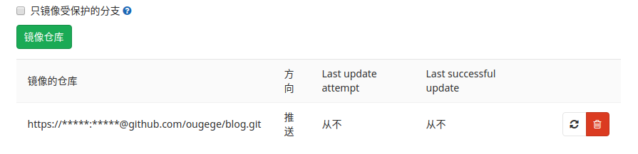

## docker安装和使用gitlab

#### 安装gitlab镜像
如未安装docker,请先移步搭建环境:[deepin搭建docker环境](./deepin搭建docker环境.md 'deepin搭建docker环境')

```
# 安装gitlab社区版
docker pull gitlab/gitlab-ce
```

#### 运行一个gitlab容器
```
# -d: 后台运行
# -p:将容器内部端口向外映射
# --name:命名容器名称
# -v:将容器内数据文件夹,日志,配置等挂载到宿主机指定目录下
docker run -d -p 443:443 -p 80:80 -p 222:22 --name gitlab --restart always -v /home/gitlab/config:/etc/gitlab -v /home/gitlab/logs:/var/log/gitlab -v /home/gitlab/data:/var/opt/gitlab gitlab/gitlab-ce
```

#### 配置gitlab.rb
```
sudo gedit /home/gitlab/config/gitlab.rb

# 配置http协议所用访问地址
external_ul 'http://127.0.0.1:80'
# 配置ssh协议所访问地址和端口
gitlab_rails['gitlab_ssh_host'] = 'http://127.0.0.1:80'
# 222端口是run时22端口映射的
gitlab_rails['gitlab_shell_ssh_port'] = 222
# 保存,重启gitlab容器
docker restart gitlab
```

#### gitlab邮件设置
```
# 进入容器
docker exec -it gitlab bash
# 退出容器
exit
```

#### gitlab切换为中文
```
头像 => setttings => 左侧边栏preferences => language
```

#### 添加SSH keys
可参考[Git安装和配置](../Git/Git安装和配置.md 'Git安装和配置')

#### 从github导入项目
```
# 保存token
# github => settings => Developer settings
# Personal access tokens => Generate new token
# select repo => Generate token => 复制并保存token

# 导入项目
# gitlab => 创建项目 => import project => github => 填入token => 导入
```

#### 自动同步到github
```
# 选择一个项目 => 左侧设置 => 仓库
# 填入对应的github项目地址,注意//后插入用户名,例如
https://ougege@github.com/ougege/blog.git
# 密码位置输入之前获得的token或者当前github用户的密码
```


#### 参考
1. [docker下gitlab安装配置使用(完整版)](https://www.jianshu.com/p/080a962c35b6 'docker下gitlab安装配置使用(完整版)')
1. [deepin搭建docker环境](./deepin搭建docker环境.md 'deepin搭建docker环境')
1. [Git安装和配置](../Git/Git安装和配置.md 'Git安装和配置')
1. [gitlab代码自动同步到github](https://www.cnblogs.com/sxdcgaq8080/p/10530176.html 'gitlab代码自动同步到github')
1. [docker部署gitlab配置SMTP](https://blog.csdn.net/xiazichenxi/article/details/90233332 'docker部署gitlab配置SMTP')
1. [gitlab使用163邮箱向用户发送邮件](https://www.jianshu.com/p/3ff4c301a446 'gitlab使用163邮箱向用户发送邮件')

