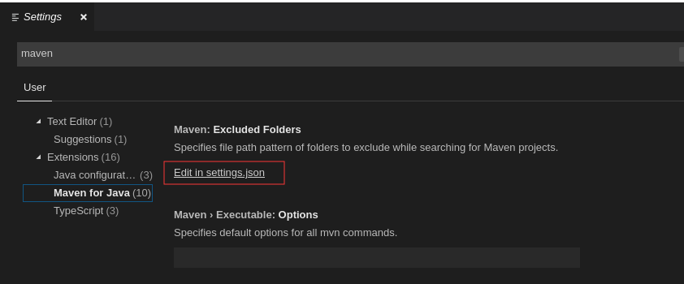

## 使用vscode进行java开发

#### 前言
在`vscode`上快速开发`java`我们需要先搭建环境,比如`java`,`maven`等

#### 安装java
1. 注册`oracle`账号用户`jdk`下载  [注册](https://profile.oracle.com/myprofile/account/create-account.jspx '注册')

1. 下载`jdk` [java-se](https://www.oracle.com/technetwork/java/javase/downloads/jdk8-downloads-2133151.html 'java-se')

1. 新建一个目录用于安装`jdk`,将`jdk`解压复制到文件夹内
    ```SHELL
    # username为当前用户
    mkdir /home/username/java
    ```
1. 设置环境变量
    ```SHELL
    sudo vim /etc/profile
    # 将以下内容加到最后
    set java environment
    JAVA_HOME=/home/username/java/jdk1.8.0_231     
    JRE_HOME=/home/username/java/jdk1.8.0_231/jre     
    CLASS_PATH=.:$JAVA_HOME/lib/dt.jar:$JAVA_HOME/lib/tools.jar:$JRE_HOME/lib
    PATH=$PATH:$JAVA_HOME/bin:$JRE_HOME/bin
    export JAVA_HOME JRE_HOME CLASS_PATH PATH
    ```
1. 让环境变量生效
    ```SHELL
    source /etc/profile
    ```

1. 测试
    ```SHELL
    java -version
    ```

#### 安装maven
1. 官网 [下载](http://maven.apache.org/download.cgi '下载') 最新版

1. 新建一个目录用户安装maven,将文件解压复制到文件夹内
    ```SHELL
    # username 为当前用户
    mkdir /home/ougege/maven
    ```

1. 设置环境变量
    ```SHELL
    sudo vim /etc/profile
    # 将以下内容加到最后:注意之前java的export调整了
    JAVA_HOME=/home/ougege/program/jdk1.8.0_231      
    JRE_HOME=/home/ougege/program/jdk1.8.0_231/jre   
    CLASS_PATH=.:$JAVA_HOME/lib/dt.jar:$JAVA_HOME/lib/tools.jar:$JRE_HOME/lib
    PATH=$PATH:$JAVA_HOME/bin:$JRE_HOME/bin

    MAVEN_HOME=/home/ougege/program/maven-3.6.2
    PATH=${PATH}:${MAVEN_HOME}/bin
    export JAVA_HOME JRE_HOME CLASS_PATH PATH MAVEN_HOME
    ```

1. 让环境变量生效
    ```SHELL
    source /etc/profile
    ```

1. 测试
    ```SHELL
    mvn -v
    ```

#### vscode配置
1. 安装扩展 `Java Extension Pack` 和 `Spring Boot Extension Pack`
1. 配置maven
    ```SHELL
    # file => Prefernces => settins => 搜索maven
    ```

    

1. 填入配置(java和maven目录及版本自行替换)
    ```JSON
    {
        "workbench.iconTheme": "vscode-icons",
        "workbench.startupEditor": "newUntitledFile",
        "java.errors.incompleteClasspath.severity": "ignore",
        "workbench.colorTheme": "Atom One Dark",
        "java.home":"/home/ougege/program/jdk1.8.0_231",
        "java.configuration.maven.userSettings": "/home/ougege/program/maven-3.6.2/conf/settings.xml",
        "maven.executable.path": "/home/ougege/program/maven-3.6.2/bin/mvn",
        "maven.terminal.useJavaHome": true,
        "maven.terminal.customEnv": [
            {
                "environmentVariable": "JAVA_HOME",
                "value": "/home/ougege/program/jdk1.8.0_231"
            }
        ],
    }
    ```

#### 创建一个maven项目
```SHELL
View => Command Palette
```

#### 连接数据库
修改 `app.java`
```JAVA
package com.ougege.myapp;
import java.sql.*;
public class App {
    static final String JDBC_DRIVER = "com.mysql.jdbc.Driver";
    static final String url = "jdbc:mysql://localhost:3306/test";  
    // 数据库的用户名与密码，需要根据自己的设置
    static final String user = "ougege";
    static final String password = "ougege";
    public static void main( String[] args ) {
        Connection conn = null;
        Statement stmt = null;
        try{
            // 注册 JDBC 驱动
            Class.forName(JDBC_DRIVER);
            // 打开链接
            System.out.println("连接数据库...");
            conn = DriverManager.getConnection(url, user, password);
            // 执行查询
            System.out.println(" 实例化Statement对象...");
            stmt = conn.createStatement();
            String sql;
            sql = "SELECT * FROM user";
            ResultSet rs = stmt.executeQuery(sql);
        
            // 展开结果集数据库
            while(rs.next()){
                // 通过字段检索
                int height = rs.getInt("height");
                String name = rs.getString("name");
                System.out.println(String.format("height=%d, name=%s", height, name));
            }
            // 完成后关闭
            rs.close();
            stmt.close();
            conn.close();
        }catch(SQLException se){
            // 处理 JDBC 错误
            se.printStackTrace();
        }catch(Exception e){
            // 处理 Class.forName 错误
            e.printStackTrace();
        }finally{
            // 关闭资源
            try{
                if(stmt!=null) stmt.close();
            }catch(SQLException se2){
            }// 什么都不做
            try{
                if(conn!=null) conn.close();
            }catch(SQLException se){
                se.printStackTrace();
            }
        }
        System.out.println("Goodbye!");
    }
}
```

#### 参考
1. [Linux上Java的安装与配置](https://www.cnblogs.com/lamp01/p/8932740.html 'Linux上Java的安装与配置')
1. [Linux下Java和Maven的安装及配置](https://blog.csdn.net/ula_liu/article/details/80853713 'Linux下Java和Maven的安装及配置')
1. [VsCode搭建Java开发环境](https://www.cnblogs.com/miskis/p/9816135.html 'VsCode搭建Java开发环境')
1. [Java mysql连接](https://www.runoob.com/java/java-mysql-connect.html 'Java mysql连接')